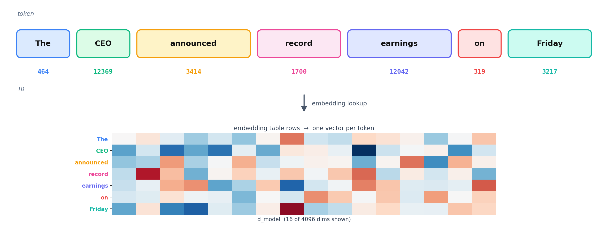
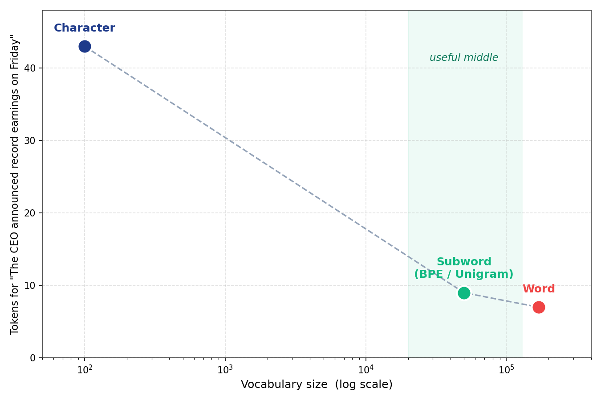
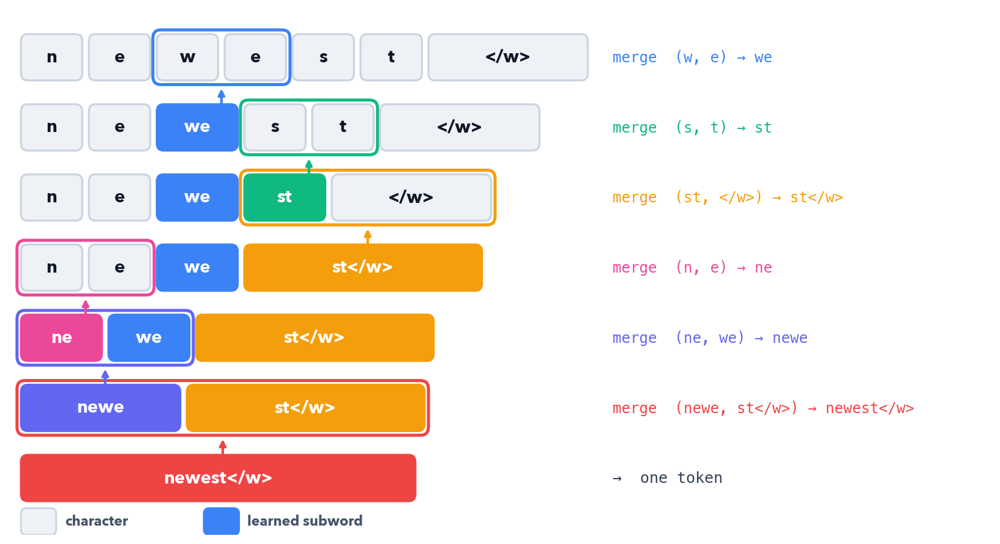

# Tokenizers: From Characters to Byte-Level BPE

*How raw text becomes the integer IDs a transformer actually reads*

## Introduction

A transformer never sees text. It sees integers. Tokenization is the layer that turns *"The CEO announced record earnings on Friday"* into a list of IDs the embedding table can look up, and turns the model's output IDs back into text. Every choice here ripples through the whole model: vocabulary size sets the embedding and output-projection dimensions, and the segmentation granularity sets how many positions each sentence costs.

The whole field is one tradeoff played out in different ways: **vocabulary size versus sequence length**. Split into characters and the vocabulary is tiny but sequences are long and each unit carries little meaning. Split into words and each unit is meaningful but the vocabulary explodes and any unseen word is out-of-vocabulary. Subword tokenization is the compromise that every modern LLM ships with: common words stay whole, rare words break into reusable pieces, and nothing is ever truly unknown.

Running example throughout: *"The CEO announced record earnings on Friday"*, 7 words. We will watch how each scheme segments it, and how many tokens it costs.

Each scheme makes a different cut:

- **Character-level**: one token per character, tiny vocab (~100), very long sequences, no out-of-vocab
- **Word-level**: one token per word, huge vocab (100k+), short sequences, breaks on unseen words
- **BPE**: merge the most frequent adjacent pair, repeat; the subword workhorse since 2016
- **Byte-level BPE**: run BPE over raw bytes, not characters; GPT-2 onward, literally no out-of-vocab
- **WordPiece**: BERT's variant, merges by likelihood gain instead of raw frequency
- **Unigram / SentencePiece**: start with a big vocab, prune the least useful tokens; LLaMA, T5

If you only need the practical answer:

- **Training a modern decoder LLM** → byte-level BPE (GPT-2/GPT-4 style) or Unigram (SentencePiece); 32k–128k vocab
- **Reproducing a checkpoint** → use that model's exact tokenizer, never re-train; IDs must match the weights
- **BERT-family encoder** → WordPiece, 30k vocab, `##` continuation markers
- **Quick experiments / learning** → BPE from scratch, then compare against `tiktoken`

**Note:** All implementations in this post are available as a runnable notebook at [github.com/backpropolis/nlp_from_scratch](https://github.com/backpropolis/nlp_from_scratch/tree/main/src/tokenizers).

---

## Why Tokenize at All?

An embedding table is a lookup: row `i` is the vector for token ID `i`. To use it, text must first become a sequence of integers in `[0, vocab_size)`. Tokenization is that mapping, and its inverse turns generated IDs back into characters.


*The tokenizer splits text into subword pieces and maps each to an integer ID; the embedding table turns each ID into a vector. Swap the tokenizer and the IDs point at the wrong rows.*

- **Vocabulary size** sets two of the model's biggest matrices: the embedding `[vocab, d_model]` and the output projection `[d_model, vocab]`. At `vocab = 128k`, `d_model = 4096`, that is ~525M parameters each
- **Sequence length** is set by how finely text is split: attention cost grows with sequence length (quadratic for full attention), so fewer tokens per sentence is cheaper
- **The contract is fixed**: the tokenizer's IDs must match the IDs the model was trained on. Swap the tokenizer and the embedding rows point at the wrong vectors

The art is choosing token *units* that keep the vocabulary small while keeping sequences short, two goals in direct tension.


*Character-level: tiny vocabulary, long sequences. Word-level: huge vocabulary, short sequences. Subword schemes (BPE, WordPiece, Unigram) sit in the useful middle, a moderate vocabulary with moderate sequence length.*

---

## Character-Level: Tiny Vocab, Long Sequences

The simplest tokenizer maps each character to an ID. The vocabulary is the set of characters that appear in the corpus, often around 100 for English including punctuation and digits.

```
"The CEO announced record earnings on Friday"
 → ['T','h','e',' ','C','E','O',' ','a','n','n','o','u','n','c','e','d', ...]
 → 43 tokens (one per character, spaces included)
```

- **Tiny vocabulary**: ~100 entries, so the embedding and output matrices are small
- **No out-of-vocabulary**: any string is representable, every character is in the vocab
- **Very long sequences**: 43 tokens for 7 words; attention cost and the number of decoding steps scale with that length
- **Weak units**: a single character carries almost no meaning, so the model must spend early layers reassembling words before it can reason about them

Character-level works for small models and tasks with limited vocabularies, but for language modeling at scale the sequence-length blowup is fatal.

---

## Word-Level: Meaningful Units, Exploding Vocab

The opposite extreme: one token per word, split on whitespace and punctuation.

```
"The CEO announced record earnings on Friday"
 → ['The','CEO','announced','record','earnings','on','Friday']
 → 7 tokens
```

- **Short sequences**: 7 tokens for 7 words, the minimum
- **Meaningful units**: each token is a whole word the model can attend to directly
- **Exploding vocabulary**: English has hundreds of thousands of word forms; covering them needs a 100k+ vocab, and morphological variants (`run`, `runs`, `running`, `ran`) each take a separate slot
- **Out-of-vocabulary is fatal**: any word not seen during training maps to a single `<UNK>` token, destroying information. Names, typos, new slang, and code identifiers are all unknowable

Word-level minimizes sequence length but cannot handle the open-ended nature of real text. The fix is to let the tokenizer invent its own units between characters and words.

---

## Subword: The Compromise

Subword tokenization keeps frequent words whole and breaks rare words into smaller, reusable pieces. *"announced"* might stay a single token while a rare word like *"deleveraging"* splits into *"de"*, *"lever"*, *"aging"*.

- **Frequent words are single tokens**: common vocabulary stays short, like word-level
- **Rare words decompose**: into subword units already in the vocabulary, so nothing is out-of-vocabulary
- **Vocabulary is bounded**: a fixed budget (say 32k–128k) is allocated to the most useful units, learned from the corpus
- **Morphology emerges**: shared prefixes and suffixes (`re-`, `-ing`, `-ed`) become reusable tokens

Three algorithms dominate: BPE, WordPiece, and Unigram. They differ in *how they choose which subwords to keep*, but all produce the same kind of bounded subword vocabulary.

---

## BPE: Byte Pair Encoding

Byte Pair Encoding started as a 1994 compression algorithm (Gage) and was adapted to tokenization by Sennrich, Haddow, and Birch (*"Neural Machine Translation of Rare Words with Subword Units"*, 2016). The training rule is one line: **repeatedly merge the most frequent adjacent pair of symbols into a new symbol**.


*BPE training: start from characters, then repeatedly merge the most frequent adjacent pair into a new symbol. Here the word "newest" fuses step by step until it is a single token; each merge rule is learned once and replayed in order.*

The counts are taken across the *whole* corpus, not a single word. On a tiny corpus of `low`, `lower`, `newest`, `widest`, and `newer`, the most frequent adjacent pair is merged first, then the next, and so on. The ladder above traces one word (`newest`) through those learned merges until it is a single token.

- **Merges are frequency-greedy**: at each step, take the pair that appears most often across the corpus
- **Merge rules are ordered**: encoding a new word replays the merges in the order they were learned
- **Vocabulary = base symbols + merges**: start with characters, each merge adds one token, stop at the target size
- **End-of-word marker**: a `</w>` (or a leading-space convention) keeps the tokenizer from merging across word boundaries

Encoding a new word applies the learned merges greedily, in order:

```python
def encode_word(word: str, merges: dict[tuple[str, str], int]) -> list[str]:
    """Apply learned BPE merges to one word, lowest merge-rank first."""
    symbols = list(word) + ["</w>"]
    while True:
        # find the adjacent pair with the best (lowest) merge rank
        pairs = {(symbols[i], symbols[i + 1]) for i in range(len(symbols) - 1)}
        candidates = [(merges[p], p) for p in pairs if p in merges]
        if not candidates:
            break
        _, (a, b) = min(candidates)              # earliest-learned merge wins
        # merge every occurrence of (a, b)
        merged, i = [], 0
        while i < len(symbols):
            if i < len(symbols) - 1 and symbols[i] == a and symbols[i + 1] == b:
                merged.append(a + b); i += 2
            else:
                merged.append(symbols[i]); i += 1
        symbols = merged
    return symbols
```

### Gotchas and Trade-offs

- **Greedy, not optimal**: BPE picks locally-frequent merges; it does not search for the segmentation that minimizes token count globally
- **Whitespace handling is a convention**: the original BPE used `</w>`; GPT-2 instead attaches a leading-space marker to tokens, so `" the"` and `"the"` are different tokens
- **Deterministic encoding**: given the merge list, a word always tokenizes the same way, which matters for reproducibility

### Key Takeaway

BPE learns a bounded subword vocabulary by greedily merging the most frequent adjacent pair, over and over. It is the foundation every modern byte-level tokenizer builds on; the open question it leaves is *what the base symbols should be*, characters or bytes.

---

## Byte-Level BPE: No Out-of-Vocabulary, Ever

Character-level BPE has a hole: if a character never appeared in training (an emoji, a rare CJK glyph), it is unknown. GPT-2 (Radford et al., 2019) closed it by running BPE over **raw bytes** instead of Unicode characters. There are exactly 256 byte values, so every possible string, in any language or encoding, is representable from the base vocabulary up.

```
"Friday" → UTF-8 bytes → [70, 114, 105, 100, 97, 121] → BPE merges over bytes
"🎉"      → UTF-8 bytes → [240, 159, 142, 137]          → still representable, no <UNK>
```

- **256 base tokens**: every byte value, so any UTF-8 string decomposes with zero out-of-vocabulary
- **A byte-to-unicode remap**: GPT-2 maps the 256 bytes to printable Unicode code points (avoiding control/whitespace bytes) so merge tables and vocab files stay human-readable
- **Regex pre-tokenization first**: GPT-2 splits text with a fixed regex before BPE, so merges never cross word/punctuation boundaries and contractions like `'s` stay clean
- **Vocabulary ~50k**: GPT-2 ships 50,257 tokens (256 bytes + 50,000 merges + one `<|endoftext|>`)

The pre-tokenization regex is the unglamorous part that makes byte-level BPE behave:

```
# GPT-2 pre-tokenization pattern (simplified)
's | 't | 're | 've | 'm | 'll | 'd     # keep contractions together
 | ?\p{L}+                              # runs of letters, optional leading space
 | ?\p{N}+                              # runs of digits
 | ?[^\s\p{L}\p{N}]+                    # runs of punctuation
 | \s+                                  # whitespace
```

For our sentence, byte-level BPE keeps the common words whole and attaches leading spaces:

```
"The CEO announced record earnings on Friday"
 → ["The", " CEO", " announced", " record", " earnings", " on", " Friday"]
 → 7 tokens (GPT-2/GPT-4 keep these frequent words intact)
```

### Example Architectures

- **GPT-2 / GPT-3** (OpenAI), byte-level BPE, 50,257 vocab
- **GPT-4** (OpenAI), `cl100k_base`, ~100k vocab; **GPT-4o**, `o200k_base`, ~200k
- **LLaMA 3** (Meta, 2024), tiktoken-style byte-level BPE, 128,256 vocab (LLaMA 1/2 used SentencePiece BPE at 32k)
- **`tiktoken`** (OpenAI's fast BPE library) is the reference implementation for the GPT-family vocabularies

### Key Takeaway

Byte-level BPE makes out-of-vocabulary structurally impossible by starting from the 256 byte values, then learns merges exactly like character BPE. A regex pre-tokenizer keeps merges inside sensible boundaries. This is the default for the GPT lineage and recent LLaMA.

---

## WordPiece: Merge by Likelihood

BERT (Devlin et al., 2019) uses WordPiece (Schuster & Nakajima, 2012), which trains like BPE but changes the merge criterion. Instead of merging the most *frequent* pair, it merges the pair that most increases the likelihood of the training corpus under a unigram language model.

$$\text{score}(a, b) = \frac{\mathrm{freq}(ab)}{\mathrm{freq}(a)\cdot\mathrm{freq}(b)}$$

- **Score, not raw frequency**: a pair is worth merging only if it co-occurs more than its parts would predict independently; this favors pairs that are *informative*, not merely common
- **`##` continuation marker**: subwords that do not start a word are prefixed with `##`, so `"announced"` might tokenize as `["announce", "##d"]` and the marker records where word-internal splits happened
- **Greedy longest-match encoding**: at inference, WordPiece matches the longest prefix in the vocabulary, then continues from there

```
"announced" → ["announce", "##d"]      # ## marks a word-internal continuation
"earnings"  → ["earning", "##s"]
```

### Key Takeaway

WordPiece is BPE with a likelihood-based merge score instead of a frequency count, plus `##` markers for word-internal pieces. It is the encoder-family default (BERT, DistilBERT, ELECTRA).

---

## Unigram and SentencePiece: Prune, Don't Merge

Unigram (Kudo, 2018) inverts the strategy. Instead of building *up* from characters by merging, it starts with a *large* candidate vocabulary and prunes *down*, removing the tokens whose loss hurts the corpus likelihood least.

$$\mathcal{L} = \sum_{\text{words}} \log \sum_{\text{segmentations}} \prod_{\text{token} \in \text{seg}} p(\text{token})$$

- **Start big, prune down**: begin with many candidate substrings, iteratively drop the least useful ~10–20% until the target vocab size is reached
- **Probabilistic, not deterministic**: each token has a probability; a word can have several segmentations scored by likelihood, and the best is chosen with Viterbi
- **Subword regularization**: because multiple segmentations exist, training can *sample* them, a regularizer that improves robustness
- **SentencePiece** (Kudo & Richardson, 2018) is the library that implements Unigram (and BPE) directly on raw text, treating the space as a normal symbol (`▁`, U+2581) so it is fully reversible and language-agnostic, no whitespace pre-tokenization needed

```
"The CEO announced" → ["▁The", "▁CEO", "▁announ", "ced"]   # ▁ encodes a leading space
```

### Example Architectures

- **T5 / Flan-T5** (Google), SentencePiece Unigram, 32k vocab
- **LLaMA 1 / 2** (Meta), SentencePiece BPE, 32k vocab
- **Gemma** (Google DeepMind), SentencePiece, 256k vocab
- **mBART, ALBERT, XLNet**: SentencePiece Unigram

### Key Takeaway

Unigram prunes a large vocabulary down by likelihood instead of merging up by frequency, and supports multiple probabilistic segmentations. SentencePiece packages it (and BPE) to run directly on raw text with a reversible space marker, the default for T5, early LLaMA, and many multilingual models.

---

## Special Tokens and Chat Templates

Beyond the learned subwords, every tokenizer reserves a handful of **special tokens** the model treats as control signals, not content.

```
<|endoftext|> / </s>   end of a document or turn (EOS)
<s> / <|begin_of_text|> beginning of sequence (BOS)
<pad>                   padding for batching variable-length sequences
<unk>                   the catch-all (unused in byte-level tokenizers)
<|im_start|> ... <|im_end|>   chat-template role markers (system/user/assistant)
```

- **Reserved IDs**: special tokens occupy fixed vocabulary slots and are never produced by merges
- **Chat templates** wrap conversations in role markers so an instruction-tuned model knows who is speaking; the template is part of the tokenizer contract, not the model weights
- **Mismatch breaks generation**: using the wrong BOS/EOS or chat template at inference is a common cause of garbled instruct-model output

---

## Practical Considerations

- **Digits**: many tokenizers split numbers into single digits (LLaMA does) so arithmetic generalizes; GPT-2 does not, which is one reason older models struggle with math
- **Whitespace and code**: leading-space conventions and how runs of spaces tokenize matter enormously for code models; indentation can otherwise explode token counts
- **Multilingual fertility**: a vocab trained mostly on English spends many tokens per word on other scripts (high "fertility"); larger, balanced vocabularies (Gemma's 256k) reduce this
- **Vocabulary size is a budget**: bigger vocab means shorter sequences but larger embedding/output matrices and more rarely-seen rows; 32k–128k is the common sweet spot for decoder LLMs
- **Never re-train for a fixed checkpoint**: the tokenizer and weights are a matched pair; reproducing a model means using its exact vocab and merges

---

## Which Tokenizer Should You Use?

The trajectory across this post: from characters (tiny vocab, unusable sequence length) to words (short sequences, fatal out-of-vocab) to subword schemes that bound the vocabulary while keeping nothing truly unknown, and finally to byte-level methods that erase out-of-vocabulary entirely.

- **Training a modern decoder LLM** → byte-level BPE (GPT/tiktoken style) or SentencePiece; 32k–128k vocab, split digits, balance languages
- **Reproducing or fine-tuning a checkpoint** → that model's exact tokenizer; never re-train, IDs must match weights
- **Encoder model (BERT-style)** → WordPiece, 30k vocab, `##` continuations
- **Multilingual or code-heavy** → larger balanced vocab; check per-language fertility before committing
- **Learning the mechanics** → implement BPE from scratch, then diff your output against `tiktoken` on the same text

---

## References

- Gage, *"A New Algorithm for Data Compression"*, C Users Journal, 1994, original byte-pair encoding
- Sennrich, Haddow, Birch, *"Neural Machine Translation of Rare Words with Subword Units"*, ACL 2016, BPE for tokenization
- Schuster & Nakajima, *"Japanese and Korean Voice Search"*, ICASSP 2012, WordPiece
- Devlin, Chang, Lee, Toutanova, *"BERT: Pre-training of Deep Bidirectional Transformers"*, NAACL 2019, WordPiece in NLP
- Radford et al., *"Language Models are Unsupervised Multitask Learners"*, 2019, GPT-2 byte-level BPE
- Kudo, *"Subword Regularization: Improving Neural Network Translation Models with Multiple Subword Candidates"*, ACL 2018, Unigram LM
- Kudo & Richardson, *"SentencePiece: A simple and language independent subword tokenizer"*, EMNLP 2018, SentencePiece
- Touvron et al., *"LLaMA: Open and Efficient Foundation Language Models"*, 2023, SentencePiece BPE at 32k
- OpenAI, *"tiktoken"*, github.com/openai/tiktoken, fast BPE for the GPT-family vocabularies
