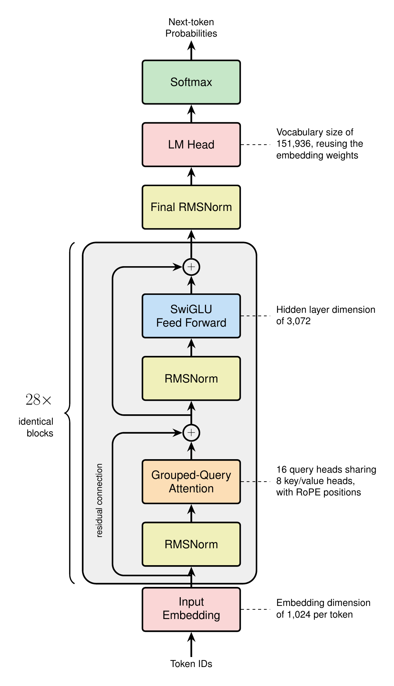
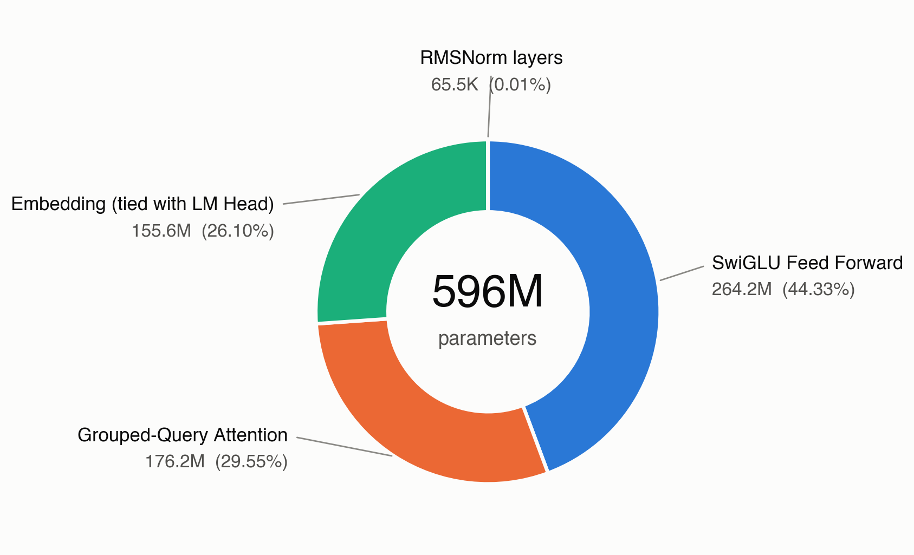
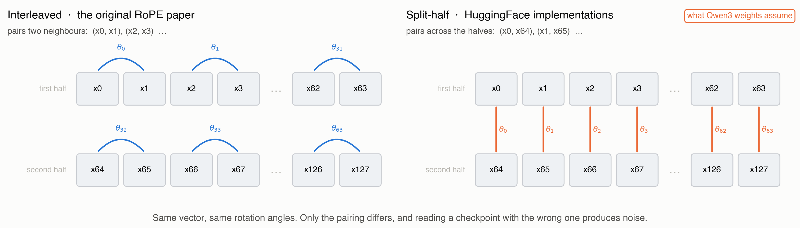
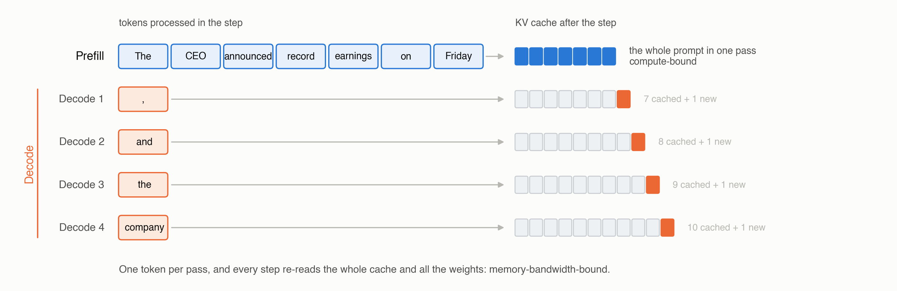

# Architecture: Assembling a Modern Dense LLM

*Every component we built, wired into one model, then loaded with real weights to prove it works*

## Introduction

The last six posts each built one piece in isolation: attention and its efficiency variants, positional encoding, normalization, activations, and the tokenizer that turns text into IDs. Every piece was tested on the same seven-token sentence and then set aside. This post wires them together into a complete decoder-only language model, counts where the parameters actually live, and then loads the published weights of a real open model into that implementation to generate text.

Loading weights is what turns the assembly into something you can check. Published weights were trained under one exact set of conventions, so they only mean anything to an implementation that shares all of them: pair the wrong dimensions in RoPE, let query heads read the wrong key heads, or put a normalization layer on the wrong side of a residual add, and the model emits noise. When the logits instead match the reference implementation, every component in the stack is verified at once.

The payoff is a model you can actually use. By the end of this post the implementation is not a sketch of an architecture; it holds real weights, answers a real prompt, and gives us a correct baseline to train our own model against later in the series.

The reference model for this post is **Qwen3-0.6B**, small enough to run on a free Colab GPU, and built from precisely the components this series has covered.

| Component | Qwen3-0.6B uses | Covered in |
|---|---|---|
| Grouped-Query Attention | 16 query heads, 8 KV heads | [Attention Variants](../2.%20attn-variants/attn-variants.md) |
| RoPE | `theta = 1,000,000` | [Positional Encoding](../3.%20positional_encoding/pos-enc.md) |
| RMSNorm, Pre-Norm, QK-Norm | `eps = 1e-6` | [Normalization](../4.%20normalization/normalization.md) |
| SwiGLU FFN | `d_ff = 3072`, no biases | [Activations](../5.%20activations/activations.md) |
| Byte-level BPE | `vocab = 151,936` | [Tokenizers](../6.%20tokenizers/tokenizers.md) |

What this post adds that no previous post covered:

- **The residual stream**: the object every block reads from and writes back into
- **The edges of the model**: embedding, final norm, LM head, and weight tying
- **The parameter budget**: where the 596M parameters of a 0.6B model actually sit
- **Weight loading**: mapping a published `state_dict` onto our modules, and the conventions that silently break it
- **Generation**: prefill and decode, and why the KV cache changes the shape of the computation

**Note:** Everything below is in one runnable notebook: [open it in Colab](https://colab.research.google.com/github/backpropolis/nlp_from_scratch/blob/main/src/architecture/9.%20architecture.ipynb) to build the model, load the real weights, and generate text without installing anything, or read the source at [github.com/backpropolis/nlp_from_scratch](https://github.com/backpropolis/nlp_from_scratch/tree/main/src/architecture).

---

## The Residual Stream

A transformer is not a pipeline that transforms its input step by step. It is a single running sum, called the residual stream, that every sublayer reads from and adds back into. Understanding this is what makes the rest of the architecture obvious.

$$
\begin{aligned}
x &\leftarrow x + \mathrm{Attn}(\mathrm{Norm}(x)) \\
x &\leftarrow x + \mathrm{FFN}(\mathrm{Norm}(x))
\end{aligned}
$$

- **The stream has one shape for the whole model**: `[B, T, d_model]`, unchanged from the embedding layer to the final norm. For Qwen3-0.6B that is `[B, T, 1024]` at every one of the 28 layers
- **Sublayers propose, they do not replace**: attention and the FFN each compute an update and add it, so information written by layer 3 is still readable by layer 27 unless something explicitly overwrites it
- **Pre-Norm keeps the identity path clean**: the normalization sits on the branch, not on the stream, so gradients flow from the loss to the embedding through an unbroken chain of additions
- **Width is a bandwidth budget**: `d_model` is how much information the stream can carry at once, which is why it appears in nearly every parameter count below

For our running sentence, *"The CEO announced record earnings on Friday"*, the stream starts as a `[7, 1024]` matrix of embedding rows and ends as a `[7, 1024]` matrix that has accumulated 56 sublayer updates. The final row of that matrix is what predicts the next token.

---

## The Block

With the stream defined, a transformer block is four lines. Everything inside those lines was built in an earlier post.

```python
class Block(nn.Module):
    """One pre-norm transformer block: attention sublayer, then FFN sublayer."""

    def __init__(self, cfg: Config):
        super().__init__()
        self.input_norm     = RMSNorm(cfg.d_model, eps=cfg.norm_eps)
        self.attn           = GroupedQueryAttention(cfg)
        self.post_attn_norm = RMSNorm(cfg.d_model, eps=cfg.norm_eps)
        self.ffn            = SwiGLU(cfg)

    def forward(self, x: torch.Tensor, freqs, kv_cache=None) -> torch.Tensor:
        """x: [B, T, d_model] -> same shape."""
        x = x + self.attn(self.input_norm(x), freqs, kv_cache)   # [B, T, d_model]
        x = x + self.ffn(self.post_attn_norm(x))                 # [B, T, d_model]
        return x
```

- **Two sublayers, two norms**: one normalization before each branch, none on the stream itself
- **`freqs` are precomputed once**: RoPE's cosines and sines depend only on position and `head_dim`, so they are computed at model construction and shared by all 28 layers rather than recomputed per block
- **The cache is per layer**: each block owns its own keys and values from previous steps, which is why generation state grows with depth

The attention sublayer is where the components interlock most tightly, and Qwen3 adds one wrinkle worth spelling out:

```python
class GroupedQueryAttention(nn.Module):
    def forward(self, x, freqs, kv_cache=None):
        B, T, _ = x.shape

        q = self.q_proj(x).view(B, T, self.n_heads,    self.head_dim)  # [B, T, 16, 128]
        k = self.k_proj(x).view(B, T, self.n_kv_heads, self.head_dim)  # [B, T,  8, 128]
        v = self.v_proj(x).view(B, T, self.n_kv_heads, self.head_dim)  # [B, T,  8, 128]

        q = self.q_norm(q)          # QK-Norm: RMSNorm over head_dim, before RoPE
        k = self.k_norm(k)

        q, k = apply_rope(q, k, freqs)                # positions enter here
        k, v = kv_cache.update(k, v) if kv_cache else (k, v)
        k = repeat_kv(k, self.n_heads // self.n_kv_heads)   # 8 KV heads -> 16
        v = repeat_kv(v, self.n_heads // self.n_kv_heads)

        out = F.scaled_dot_product_attention(q, k, v, is_causal=kv_cache is None)
        return self.o_proj(out.reshape(B, T, -1))     # [B, T, d_model]
```

- **QK-Norm comes before RoPE**: normalize the query and key vectors along `head_dim`, then rotate them. Reversing this order changes the result, and it is one of the loading bugs described later
- **`head_dim` is not `d_model / n_heads`**: Qwen3 sets `head_dim = 128` while `d_model = 1024` and `n_heads = 16`, so `16 x 128 = 2048`, twice the stream width. The query projection deliberately widens from 1024 to 2048 and the output projection narrows it back. Decoupling these lets a narrow model keep the 128-wide heads that RoPE and attention kernels are tuned for
- **Grouped-Query Attention halves the cache**: 8 key/value heads serve 16 query heads, so the KV cache stores half of what full multi-head attention would

---

## The Edges

Blocks are the middle of the model. The edges are small and easy to get wrong, and they are where a quarter of the parameters live.

```python
class LanguageModel(nn.Module):
    def __init__(self, cfg: Config):
        super().__init__()
        self.embed  = nn.Embedding(cfg.vocab_size, cfg.d_model)   # [151936, 1024]
        self.blocks = nn.ModuleList(Block(cfg) for _ in range(cfg.n_layers))
        self.norm   = RMSNorm(cfg.d_model, eps=cfg.norm_eps)      # final norm
        self.head   = nn.Linear(cfg.d_model, cfg.vocab_size, bias=False)
        if cfg.tie_embeddings:
            self.head.weight = self.embed.weight                  # one matrix, two uses

        self.register_buffer("freqs", build_rope_freqs(cfg), persistent=False)

    def forward(self, ids: torch.Tensor, kv_caches=None) -> torch.Tensor:
        """ids: [B, T] token IDs -> logits [B, T, vocab_size]."""
        x = self.embed(ids)                                       # [B, T, d_model]
        for i, block in enumerate(self.blocks):
            x = block(x, self.freqs, kv_caches[i] if kv_caches else None)
        x = self.norm(x)                                          # Pre-Norm needs this
        return self.head(x)                                       # [B, T, vocab_size]
```

- **The embedding is a lookup, not a matmul**: row `i` of a `[vocab, d_model]` table is the vector for token ID `i`, which is exactly the contract the [tokenizer post](../6.%20tokenizers/tokenizers.md) described from the other side
- **Pre-Norm requires a final norm**: because no normalization ever touched the stream itself, the accumulated sum reaching the LM head has unbounded scale. Skipping this one layer produces logits that are far too large and a model that is confidently wrong
- **Weight tying reuses the embedding as the unembedding**: the same `[151936, 1024]` matrix maps IDs to vectors on the way in and vectors to logits on the way out. It saves 155M parameters, which would otherwise make the model 26 percent larger
- **No bias anywhere**: not in the projections, not in the LM head, matching the convention described in the [activations post](../5.%20activations/activations.md)


*The whole model in one column. Each of the 28 blocks normalizes a copy of the stream, runs attention or the feed-forward network on that copy, and adds the result back, which is why the residual connection runs past the normalization straight to the plus. The embedding table is reused as the LM head at the top.*

### Gotchas and Trade-offs

- **Tying is a real constraint, not just a saving**: it forces the input and output representations of a token to share one vector. Small models take the deal because the embedding dominates their budget; larger models often untie, since 155M matters much less at 30B than at 0.6B
- **Vocabulary size is an architecture decision, not a tokenizer detail**: Qwen3's 151,936-token vocabulary costs 155M parameters at `d_model = 1024`. A 32k vocabulary would cost 33M. The tokenizer post framed this as vocabulary versus sequence length; here it is vocabulary versus parameter budget
- **The final norm is easy to forget**: it produces no error message, only degraded output

---

## The Parameter Budget

Configuration is where architecture becomes numbers. Qwen3-0.6B's published config:

```python
@dataclass
class Config:
    d_model:        int = 1024
    n_layers:       int = 28
    n_heads:        int = 16
    n_kv_heads:     int = 8          # GQA: 2 query heads per KV head
    head_dim:       int = 128        # decoupled from d_model / n_heads
    d_ff:           int = 3072       # 3.0 x d_model
    vocab_size:     int = 151936
    norm_eps:       float = 1e-6
    rope_theta:     float = 1_000_000.0
    tie_embeddings: bool = True
```

Counting parameters is arithmetic, and the breakdown is more informative than the total:

$$
\begin{aligned}
\text{attention} &= \underbrace{d_{\text{model}} \cdot n_h d_h}_{W_Q} + \underbrace{2\, d_{\text{model}} \cdot n_{kv} d_h}_{W_K,\, W_V} + \underbrace{n_h d_h \cdot d_{\text{model}}}_{W_O} \\
\text{FFN} &= 3 \cdot d_{\text{model}} \cdot d_{\text{ff}} \qquad (\text{gate, up, down})
\end{aligned}
$$

| Component | Per layer | x 28 layers |
|---|---|---|
| Attention (Q, K, V, O) | 6,291,456 | 176,160,768 |
| FFN (gate, up, down) | 9,437,184 | 264,241,152 |
| Norms (2 RMSNorm + QK-Norm) | 2,304 | 64,512 |
| Embedding (tied) | | 155,582,464 |
| Final norm | | 1,024 |
| **Total** | | **596,049,920** |


*Where the 596M parameters of Qwen3-0.6B sit. The FFN takes the largest share, the tied embedding costs as much as the entire attention stack at this scale, and normalization is invisible.*

- **The FFN is the largest consumer**: three matrices of `1024 x 3072` beat four attention matrices, which is the usual ratio for dense transformers and the reason mixture-of-experts targets the FFN rather than attention
- **Embeddings are 26 percent because the model is small**: the same 152k vocabulary inside an 8B model would be under 4 percent. Vocabulary cost is fixed while everything else scales with depth and width
- **Normalization is free**: 64k parameters across 28 layers, about one hundredth of one percent. The [normalization post](../4.%20normalization/normalization.md) argued RMSNorm halves the parameters versus LayerNorm; at this scale both are rounding errors, and the reason to prefer RMSNorm is the reduction it skips, not the parameters it saves
- **`d_ff = 3072` is exactly 3x `d_model`, not the 8/3 rule**: the activations post derived `8/3 x d_model = 2731` as the parameter-neutral SwiGLU width. Qwen3 rounds up to a hardware-friendly 3072. Real configurations round; always read the model card rather than deriving the number

### Depth Versus Width

Two models with the same parameter count can spend it differently, and the ratio has a name: aspect ratio, `d_model / n_layers`. Qwen3-0.6B sits at `1024 / 28 = 37`, a deep and narrow shape typical of small models.

- **Deeper and narrower** buys more sequential composition steps per token at the cost of harder optimization and worse parallelism
- **Wider and shallower** buys more per-layer capacity and better hardware utilization, since large matmuls are more efficient than many small ones
- **`head_dim` stays at 128 either way**: it is set by what attention kernels and RoPE are tuned for, not derived from the other dimensions

---

## Loading Real Weights

This is the part that proves the implementation. A published checkpoint is a dictionary mapping parameter names to tensors; loading it means matching every name and every shape to our modules.

```python
from safetensors.torch import load_file

sd = load_file("model.safetensors")
for name, tensor in list(sd.items())[:4]:
    print(f"{name:52s} {tuple(tensor.shape)}")

# model.embed_tokens.weight                            (151936, 1024)
# model.layers.0.self_attn.q_proj.weight               (2048, 1024)
# model.layers.0.self_attn.k_proj.weight               (1024, 1024)
# model.layers.0.self_attn.q_norm.weight               (128,)
```

The mapping from their names to ours is mechanical:

| Published name | Our module | Shape |
|---|---|---|
| `model.embed_tokens.weight` | `embed.weight` | `[151936, 1024]` |
| `model.layers.N.input_layernorm.weight` | `blocks[N].input_norm.weight` | `[1024]` |
| `model.layers.N.self_attn.{q,k,v,o}_proj.weight` | `blocks[N].attn.{...}` | see below |
| `model.layers.N.self_attn.{q,k}_norm.weight` | `blocks[N].attn.{q,k}_norm` | `[128]` |
| `model.layers.N.post_attention_layernorm.weight` | `blocks[N].post_attn_norm.weight` | `[1024]` |
| `model.layers.N.mlp.{gate,up,down}_proj.weight` | `blocks[N].ffn.{...}` | `[3072, 1024]` |
| `model.norm.weight` | `norm.weight` | `[1024]` |
| `lm_head.weight` *(or absent)* | `head.weight` | tied to `embed.weight` |

### The Conventions That Break It Silently

Every one of these produces a model that loads without error and generates nonsense.

- **RoPE has two incompatible layouts**. The original paper rotates *interleaved* pairs of dimensions, `(x_0, x_1), (x_2, x_3), ...`. HuggingFace implementations rotate *split halves*, pairing dimension `i` with dimension `i + head_dim/2`. Both are valid rotary embeddings and both train fine, but a checkpoint stored under one convention is meaningless under the other. Qwen3 weights assume the split-half convention, so `apply_rope` must pair `x[..., :64]` with `x[..., 64:]`, not adjacent elements
- **`nn.Linear` stores its weight transposed**. A layer mapping 1024 inputs to 2048 outputs holds a `[2048, 1024]` tensor, because `forward` computes `x @ W.T`. Published tensors already use this layout, so they load directly; the bug appears when you transpose them "to fix" a shape that was never wrong
- **Grouped-Query Attention requires the right expansion**. Eight KV heads serve sixteen query heads, so each KV head must be repeated for the two *consecutive* query heads assigned to it. Using `repeat` instead of `repeat_interleave` pairs every query head with the wrong keys, which the [attention variants post](../2.%20attn-variants/attn-variants.md) covered in detail
- **The LM head is governed by a config flag, not by the file listing**. With `tie_word_embeddings: true`, some checkpoints omit `lm_head.weight` entirely while others, including Qwen3-0.6B, store a full duplicate of the embedding matrix under that name. Both are correct and both must end up tied; read the flag rather than inferring intent from which tensors happen to be present. Initializing the head randomly instead produces fluent-looking internals and uniform garbage at the output
- **QK-Norm applies per head, before RoPE**. The `q_norm` tensor has shape `[128]`, which is `head_dim`, not `d_model`. It normalizes each head's vector individually, and it runs before the rotation


*The two rotary layouts. Interleaved rotation pairs adjacent dimensions `(x0, x1), (x2, x3), ...`; split-half rotation pairs `x0` with `x64`, `x1` with `x65`, and so on. Both are valid, both train, and a checkpoint written under one is meaningless under the other.*

### Verifying

Do not trust generated text as the test; trust numbers first.

```python
ours = LanguageModel(Config()); ours.load_state_dict(remap(sd)); ours.eval()
ref  = AutoModelForCausalLM.from_pretrained("Qwen/Qwen3-0.6B", torch_dtype=torch.float32).eval()

ids = tokenizer("The CEO announced record earnings on Friday", return_tensors="pt").input_ids
with torch.no_grad():
    a, b = ours(ids), ref(ids).logits

print(f"max abs diff: {(a - b).abs().max():.2e}")     # observed: 0.00e+00
assert a.argmax(-1).equals(b.argmax(-1))              # identical predictions
```

Running this against Qwen3-0.6B in float32 gives a maximum logit difference of exactly zero: when the operations and their order match the reference, the arithmetic is bit-identical, not merely close.

- **Compare logits, not text**: sampling hides small errors and exaggerates others
- **Do not require zero, but treat it as the target**: differing kernel or reduction orders can legitimately produce differences around `1e-4` in float32, and far looser ones in bfloat16. A difference of `1e-1` or larger is a bug, not numerics
- **Bisect by layer when it fails**: run both models with hooks and compare the residual stream after each block. The first layer where the difference jumps from `1e-5` to `1e-1` contains the bug

---

## Generation

A trained model is a next-token distribution. Turning it into text is a loop with two distinct phases, and the difference between them shapes every inference system.

```python
@torch.no_grad()
def generate(model, ids, max_new_tokens=64, temperature=0.7, top_p=0.9):
    caches = [KVCache() for _ in model.blocks]

    logits = model(ids, caches)[:, -1]              # PREFILL: all T tokens at once
    for _ in range(max_new_tokens):
        next_id = sample(logits, temperature, top_p)   # [B, 1]
        ids = torch.cat([ids, next_id], dim=1)
        logits = model(next_id, caches)[:, -1]      # DECODE: one token at a time
    return ids
```

- **Prefill processes the prompt in parallel**: all seven tokens of our sentence enter at once, the causal mask keeps each position from seeing the future, and the keys and values for all seven positions land in the cache. This phase is compute-bound
- **Decode processes exactly one token per step**: its query attends to every cached key, and its own key and value are appended. The matrices are tiny and the weights must be re-read from memory each step, so this phase is memory-bandwidth-bound
- **The cache is why decode is cheap**: without it, each new token would recompute keys and values for the entire prefix, turning generation into repeated quadratic work
- **Cache size grows linearly with context**: `2 x n_layers x n_kv_heads x head_dim x T` values. At 4096 tokens, Qwen3-0.6B holds roughly 470MB in bfloat16 and twice that in float32, which is why Grouped-Query Attention halved `n_kv_heads` in the first place


*Two phases with different bottlenecks. Prefill pushes all seven prompt tokens through the model at once and fills the cache; decode then runs one token per step, reading the whole cache and appending one key and value to it. Prefill is compute-bound, decode is memory-bandwidth-bound.*

---

## Comparing Open Dense Models

The same five slots, filled differently. Every model below is dense; mixture-of-experts variants are the subject of the next post.

| Model | Norm | Position | Attention | FFN | Vocab |
|---|---|---|---|---|---|
| **Llama 3.2 1B** | RMSNorm, Pre-Norm | RoPE | GQA | SwiGLU | 128,256 |
| **Qwen3-0.6B** | RMSNorm, Pre-Norm, QK-Norm | RoPE, `theta=1M` | GQA, `head_dim=128` | SwiGLU | 151,936 |
| **Gemma 3 1B** | RMSNorm, pre *and* post sublayer, QK-Norm | RoPE, local/global mix | GQA | GeGLU | 262,144 |
| **Mistral 7B** | RMSNorm, Pre-Norm | RoPE | GQA + sliding window | SwiGLU | 32,000 |
| **SmolLM3 3B** | RMSNorm, Pre-Norm | RoPE with NoPE layers | GQA | SwiGLU | 128,256 |
| **OLMo 2 7B** | RMSNorm, reordered post-sublayer, QK-Norm | RoPE | MHA | SwiGLU | 100,278 |

- **The backbone has converged**: pre-norm RMSNorm, RoPE, GQA, and a gated FFN appear in essentially every recent dense model. Disagreement is concentrated in normalization placement, vocabulary size, and whether QK-Norm is present
- **Vocabulary spans an 8x range**: from Mistral's 32k to Gemma 3's 262k. Larger vocabularies shorten sequences and help multilingual coverage, at a parameter cost that only large models absorb comfortably
- **Stability tricks cluster at scale**: QK-Norm and extra post-sublayer norms show up where training instability appeared, exactly as the normalization post described
- **Configurations diverge more than architectures**: aspect ratio, `d_ff` multiple, and RoPE theta vary widely between models that otherwise share every component

---

## Which Choices Actually Matter?

Building the whole thing makes the hierarchy visible. Some decisions change what the model can do; others change a number in a config file.

- **Load-bearing**: pre-norm placement, the residual stream itself, a gated FFN, and some form of positional information. Getting any of these wrong changes training dynamics or breaks the model outright
- **Efficiency levers**: GQA ratio, `head_dim`, sliding-window layers, and vocabulary size. These trade memory and speed against quality, and every model picks a different point
- **Stability insurance**: QK-Norm and extra norms. Invisible at small scale, decisive at large scale
- **Nearly free to change**: `d_ff` rounding, RMSNorm epsilon, RoPE theta below the context length you actually use
- **Reproducing a checkpoint**: nothing is free. Every convention, including the two RoPE layouts, must match the published weights exactly

The next post takes the one component this model kept dense, the FFN, and replaces it with a router and a set of experts.

---

## References

- Vaswani et al., *"Attention Is All You Need"*, NeurIPS 2017, the original block structure
- Radford et al., *"Language Models are Unsupervised Multitask Learners"*, 2019, decoder-only stack with weight tying
- Press & Wolf, *"Using the Output Embedding to Improve Language Models"*, EACL 2017, weight tying
- Su et al., *"RoFormer: Enhanced Transformer with Rotary Position Embedding"*, 2021, RoPE and its interleaved formulation
- Ainslie et al., *"GQA: Training Generalized Multi-Query Transformer Checkpoints"*, EMNLP 2023, grouped-query attention
- Shazeer, *"GLU Variants Improve Transformer"*, 2020, SwiGLU
- Zhang & Sennrich, *"Root Mean Square Layer Normalization"*, NeurIPS 2019, RMSNorm
- Dehghani et al., *"Scaling Vision Transformers to 22 Billion Parameters"*, 2023, QK-Norm
- Qwen Team, *"Qwen3 Technical Report"*, 2025, the reference model for this post
- Touvron et al., *"LLaMA: Open and Efficient Foundation Language Models"*, 2023, the dense recipe most models still follow
